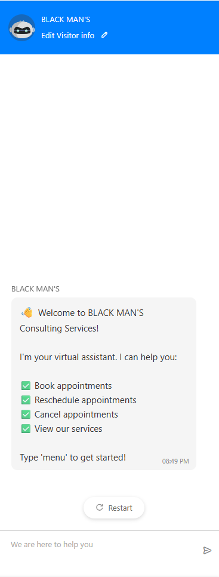
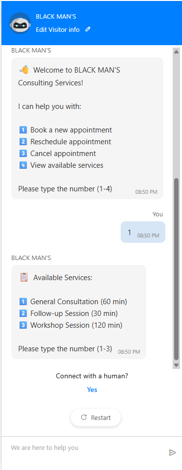
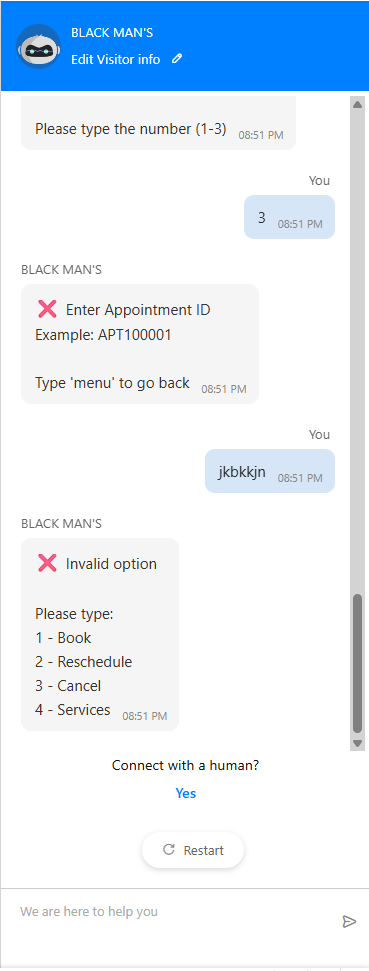

<h1 align="center" id="title">BLACK MAN'S Appointment Scheduler Bot</h1>

<p align="center">
  
</p>

---

## Project Description

**BLACK MAN'S Appointment Scheduler Bot** is an intelligent **conversational AI assistant** developed for the **Zoho Cliqtrix 25 Competition**.  
It automates appointment scheduling workflows including:

- **Booking appointments**
- **Rescheduling existing appointments**
- **Canceling appointments**
- **Browsing available services**
- **Checking real-time slot availability**

Integrated with **Google Calendar** through **Google Apps Script**, the bot ensures:

- Live availability validation  
- Instant appointment confirmation  
- Unique Appointment ID tracking  
- 24/7 automated scheduling support  

---

---

##  Results & Output Preview

<p align="center">
  
  
  
</p>

---


## Features

- **Conversational AI Interface** for smooth user interaction  
- **Google Calendar Sync** for real-time availability checks  
- **Automatic Slot Generation** based on business working hours  
- **Appointment Management** (Reschedule & Cancel)  
- **Email Confirmation Support**  
- **User Input Validation** for secure appointment scheduling  
- **Appointment ID Tracking** for quick future reference  

---


##  Installation & Setup

### Prerequisites

- Zoho SalesIQ Account  
- Google Account with Calendar Access  

---

### 🔹 Google Apps Script Setup

1. Open **Google Apps Script console**
2. Create a new project  
3. Add these files from `/backend/` folder:
   - `Code.gs`
   - `Config.gs`
   - `Utilities.gs`
   - `Calendar.gs`
4. Update your calendar ID inside `Config.gs`:

```javascript
CALENDAR_ID = "your-calendar-id@gmail.com";


Deploy the project as a Web App

Copy the Deployment URL and paste it in your Context Handler:

scriptUrl = "YOUR_APPS_SCRIPT_WEB_APP_URL";

🔹 Zoho SalesIQ Bot Setup

Go to Settings → Bot → Zobot

Click Create Bot

Add handlers from /salesiq-handlers/ folder:

Handler Type	File
Trigger	trigger_handler.deluge
Message	message_handler.deluge
Context	context_handler.deluge
Failure	failure_handler.deluge

Enable and Publish the bot ✅

🔹 Website Integration

Paste this before your closing </body> tag:

<script>
  window.$zoho = window.$zoho || {};
  $zoho.salesiq = $zoho.salesiq || { ready: function() {} };
</script>
<script id="zsiqscript" src="YOUR_WIDGET_URL" defer></script>

💬 Usage
🗓️ Book an Appointment

Open bot → Type menu → Press 1

Choose service → Enter details → Type CONFIRM

Save your Appointment ID ✅

🔁 Reschedule

menu → 2 → Appointment ID → Select new slot/date/time

❌ Cancel

menu → 3 → Appointment ID → Confirm cancellation

📋 View Services

menu → 4 → Browse service catalog

🔮 Future Improvements

 AI-based slot suggestions

 SMS reminders

 Payments integration

 Multi-language support

 Voice-based booking

 CRM synchronization

 Video call scheduling

🤝 Contributing

Fork this repository

Create a feature branch

Commit your changes

Push and open a pull request ✅

📧 Contact

For support or collaboration:

Email: l.churchill427@gmail.com

GitHub: Churchill427

LinkedIn: Your LinkedIn Profile Link Here

⚠️ Disclaimer

This is a competition prototype. For production use ensure:

Security refinement

Scalability testing

Code review

Compliance validation

📄 License

This project is licensed under the MIT License.
